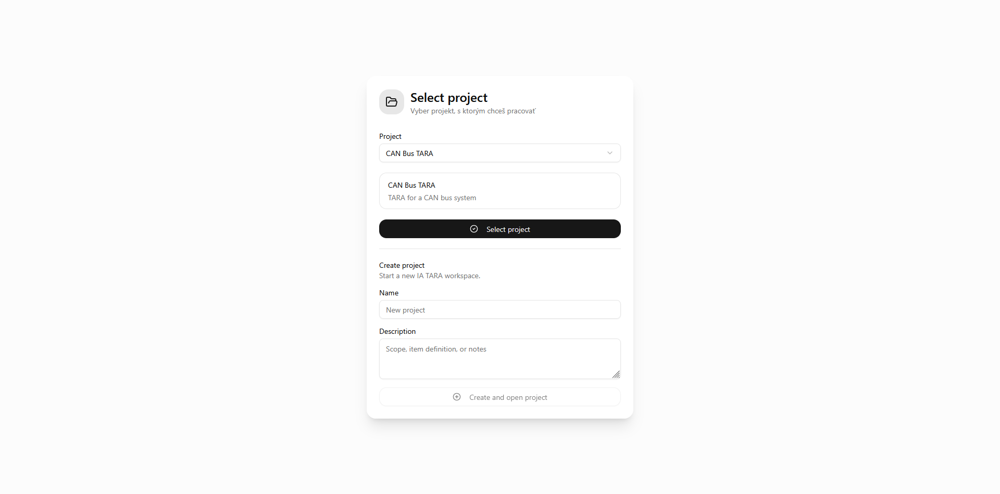
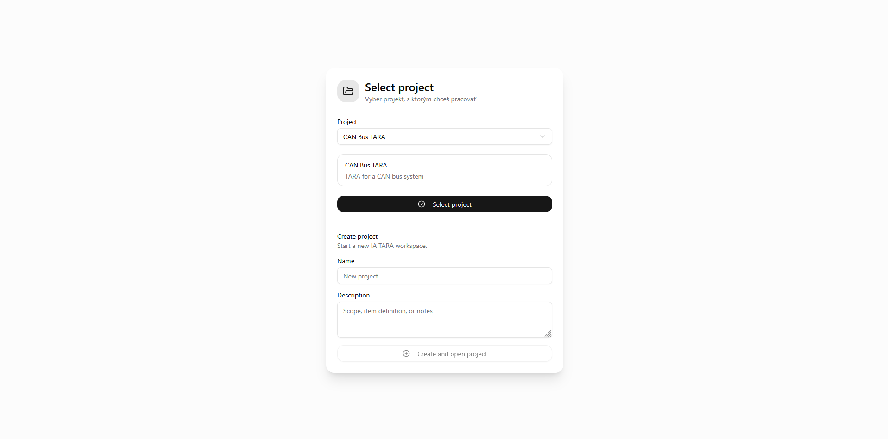
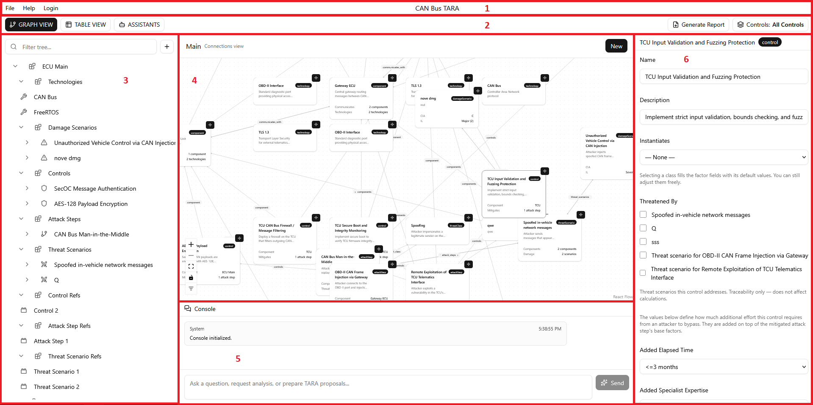
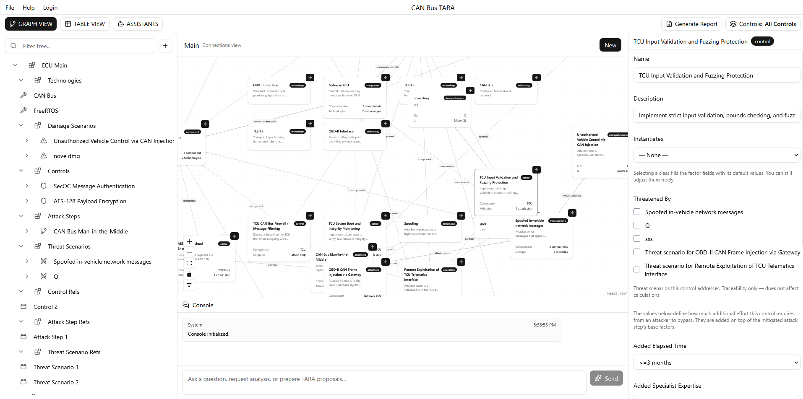
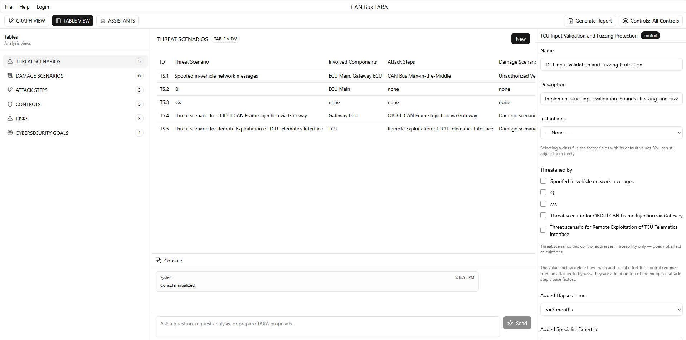
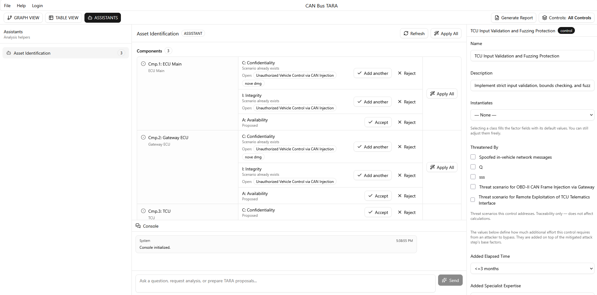
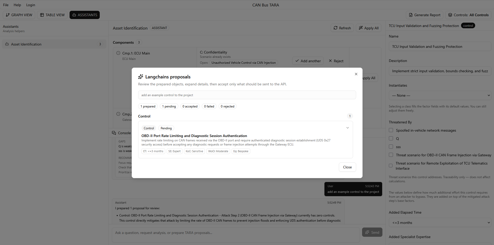
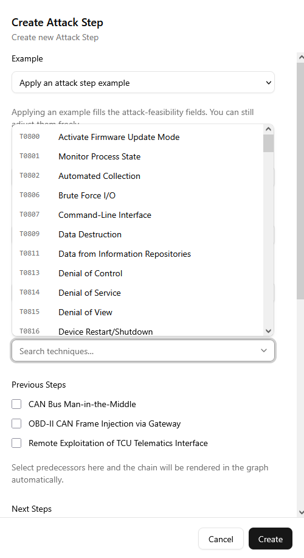
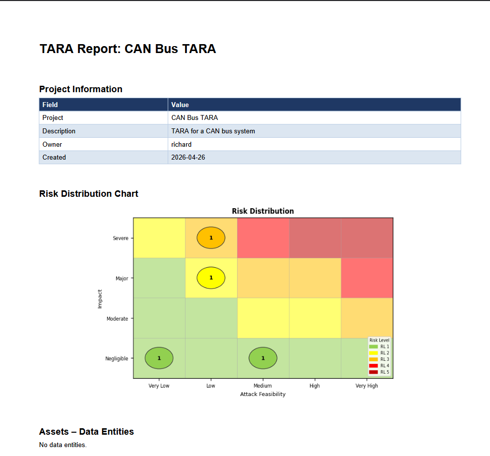

# IA-TARA Program Guide

This guide describes the basic workflow and the main functions of the IA-TARA application.

## 1. Start, Login and Create User

1. Start the backend server.
2. Start the frontend application.
3. Open the frontend in the browser.
4. On the login screen, enter:
   - backend address, for example `http://127.0.0.1:8000`
   - username
   - password
5. Click **Login**.

After login, the application stores the access token for the current browser session and uses it when communicating with the backend.

If you do not have a user yet, click **Create a new user** on the login screen.

In create-user mode, enter:

- backend address,
- username,
- optional email,
- password.

Then click **Create user and login**. The application creates the user through the backend and automatically logs in with the new account.

## 2. Select or Create a Project

After login, choose the project you want to work with.

You can:

- select an existing project from the list,
- create a new project by entering its name and optional description.

A project is one complete TARA workspace. All components, scenarios, risks, controls and reports belong to the selected project.

## 3. Main Application Layout

After opening a project, the screen is divided into several parts:

1. **Top menu** - file actions and help.
2. **Toolbar** - switches between Graph View, Table View and Assistants.
3. **Left panel** - navigation depending on the active view.
4. **Main panel** - graph, table or assistant content.
5. **Console** - chat/assistant area and model analysis.
6. **Right panel** - details and editor for the selected object.

The same project data is used everywhere. If you edit something in the details panel, the graph and tables update from the same backend model.

The top menu also contains **Login**. This clears the current session and returns the application to the login screen. Use it when you want to switch user.

## 4. Graph View

Graph View is used to model and inspect relationships visually.

Each object is shown as a card:

- component,
- technology,
- data entity,
- threat scenario,
- damage scenario,
- attack step,
- control,
- compromise,
- threat class.

Cards are connected by lines that represent relationships.

Common actions:

- Click a card to select it.
- Drag a card to move it.
- Use the handles on cards to create relationships.
- Use the filter control to search by name or object type.
- Use **New** to create a new model object.

The graph layout is stored locally in the browser. In the **File** menu you can save or load the layout as JSON.

## 5. Project Tree

The left panel in Graph View shows the project tree.

Use it to:

- browse components and related items,
- search for an object,
- select an item and focus it in the graph,
- create or connect related objects.

When an object is selected, the plus button allows you to create a new related object or connect an existing one.

## 6. Details Panel

The right panel shows details of the selected object.

You can use it to:

- edit names and descriptions,
- change TARA ratings,
- connect related objects,
- delete objects,
- navigate to related objects.

Changes are saved automatically after a short delay.

Important forms:

- **Damage Scenario** - edit CIA impact, affected components and safety/financial/operational/privacy impact.
- **Attack Step** - edit required access and attack feasibility factors.
- **Control** - edit mitigation effort factors and connect controls to attack steps.
- **Threat Scenario** - connect components, attack steps and damage scenarios.
- **Cybersecurity Goal** - define CAL and connect goals to damage scenarios and controls.

## 7. Table View

Table View is used for review and analysis.

Available tables:

- **Threat Scenarios**
- **Damage Scenarios**
- **Attack Steps**
- **Controls**
- **Risks**
- **Cybersecurity Goals**

Clicking a row selects the object and opens its details. Some rows can be expanded to show additional information.

The **Risks** table shows calculated values:

- AFL - Attack Feasibility Level,
- IL - Impact Level,
- RL - Risk Level,
- CIA impact,
- treatment decision.

In the expanded risk detail, you can set risk treatment:

- Avoid,
- Reduce,
- Share,
- Accept.

You can also add a short rationale.

## 8. Controls and Control Groups

Controls represent mitigations or security measures.

A control can be connected to:

- a component,
- attack steps,
- threat scenarios.

Controls connected to attack steps affect the calculated attack feasibility.

The **Controls** button in the toolbar opens the Control Groups manager.

Built-in groups:

- **All Controls** - all controls are active.
- **No Controls** - no controls are active.

You can also create custom control groups. This is useful for comparing different mitigation plans, for example:

- minimal controls,
- proposed controls,
- production controls.

The selected control group affects the risk values shown in the frontend.

## 9. Assistants

The **Assistants** view contains helper tools.

### Asset Identification

This assistant goes through existing data entities and components. For each one it proposes CIA-related damage and threat scenarios:

- Confidentiality,
- Integrity,
- Availability.

You can:

- accept one proposal,
- reject one proposal,
- restore a rejected proposal,
- apply all proposals for one asset,
- apply all proposals in the project.

When accepted, the assistant creates:

- a threat scenario,
- a damage scenario,
- affected component/CIA information if available.

This is useful at the beginning of analysis when components are already modeled but scenarios are still missing.

## 10. Console and LLM Proposals

The console at the bottom can be used to ask questions or request proposals.

Example prompts:

- `Analyze the current model`
- `Find missing controls`
- `Create an example control for the gateway firmware flashing risk`
- `Suggest attack steps for the central gateway`

The assistant can return:

- normal text answers,
- analysis of the current model,
- proposed model objects.

Proposals are not saved automatically. They open in a review dialog. You can accept or reject each proposal individually.

This keeps the user in control and prevents the assistant from changing the project without approval.

If the backend LLM assistant is not available, the frontend can still provide a simple local fallback analysis.

## 11. MITRE Integration

The application supports simple MITRE ATT&CK references.

You can use MITRE-related fields for:

- threat classes,
- attack steps.

Threat classes can store MITRE tactic ID/name. Attack steps can store MITRE technique ID/name.

This helps keep terminology consistent with known cybersecurity attack patterns.

## 12. Generate Report

Use **Generate Report** in the toolbar to export the current project.

The PDF report contains:

- project information,
- risk distribution chart,
- data entities,
- components,
- damage scenarios,
- threat scenarios,
- attack paths,
- attack steps,
- controls,
- risks,
- control group comparison,
- risk treatment,
- cybersecurity goals.

The generated report is downloaded by the browser as a PDF file.

## 13. Recommended Workflow

A typical workflow is:

1. Create or open a project.
2. Define system components.
3. Add technologies and data entities.
4. Connect components that communicate with each other.
5. Use Asset Identification assistant to create initial CIA-based scenarios.
6. Refine damage scenarios and impact ratings.
7. Create threat scenarios.
8. Create attack steps and connect them into attack paths.
9. Connect attack steps to threat scenarios.
10. Connect threat scenarios to damage scenarios.
11. Add controls and connect them to attack steps.
12. Create control groups to compare mitigation options.
13. Review risks in Table View.
14. Add risk treatment decisions and rationale.
15. Define cybersecurity goals.
16. Generate the final PDF report.

The workflow does not have to be strictly linear. You can switch between graph, tables, assistants and console at any time.

## 14. Practical Tips

- Start with components. Most other objects are easier to connect once components exist.
- Use Graph View when building relationships.
- Use Table View when checking completeness and risk values.
- Use the Details panel for precise editing.
- Use control groups to compare mitigation strategies.
- Use the LLM console for suggestions, but review every proposal before accepting it.
- Generate the report only after relationships and ratings are reasonably complete.
